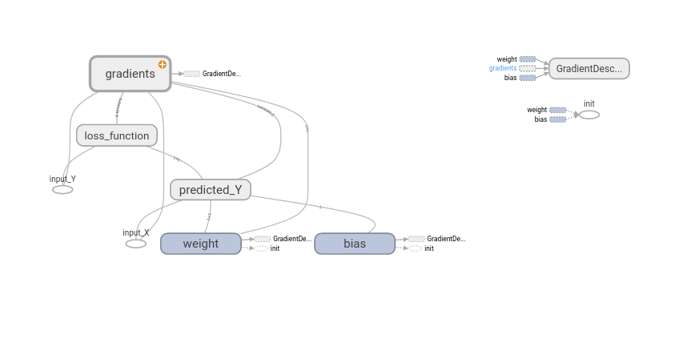
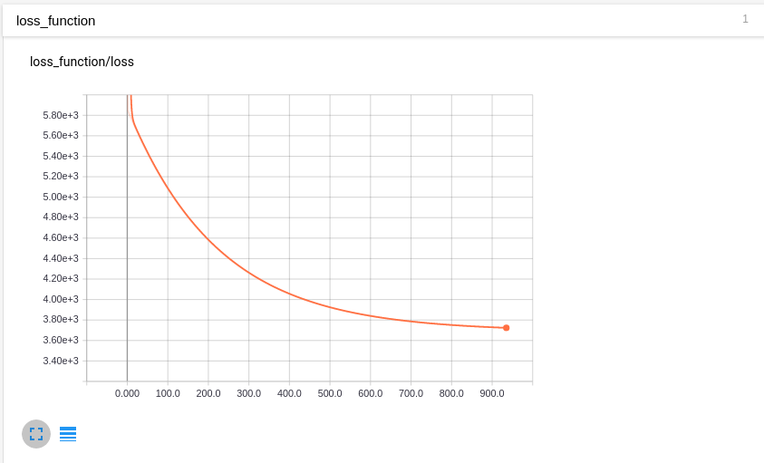

# Machine Learning Sample Experiments

## 1. Linear Regression Model Visualization Using Tensorflow and Tensorboard.
    > #### Visualization of Model Graph in Tensorboard.
    
    
    > #### Visualization of Learning Curve in Tensorboard
    
